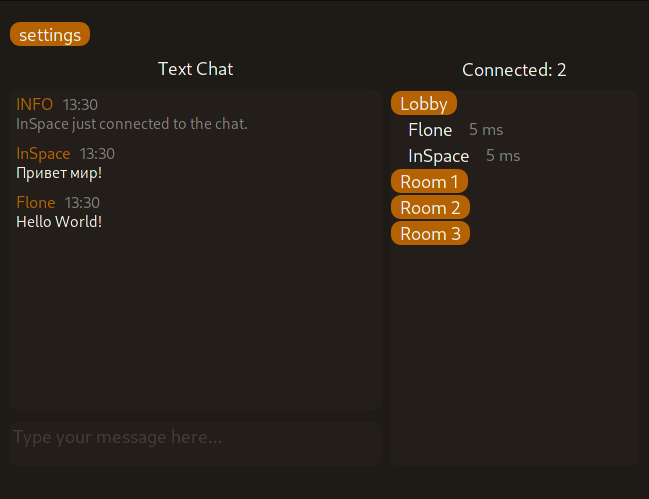

# Silent

  

Must be used with the [Silent Server](https://github.com/Flone-dnb/silent-server-rs) application.

# Localization

The application is translated into the following languages: English, Russian. 
The application itself does not contain a lot of text to translate so it could be easily translated into other languages. 
If you want to translate the application into some other not supported language follow there steps:
<ol>
  <li>Edit the "localization.ods" file located in the "res" folder using LibreOffice Calc: add a new locale name in the first row (locale name should contain only 2 ASCII characters).</li>
  <li>Add translations to all keys.</li>
  <li>Save this file and also save it as .CSV format to the "res/localization.csv" file with default export settings.</li>
  <li>Submit the pull request to this repo with your changes.</li>
</ol>

# Build

<h3> 1. Install dependencies </h3>
<h4> Linux (Debian based) </h4>
<pre>
sudo apt install cmake libopenal-dev libfontconfig1-dev libasound2-dev libsfml-dev libcsfml-dev
</pre>
<h4> Linux (Arch based) </h4>
<pre>
sudo pacman -S cmake csfml sfml openal
</pre>
<h4> Windows </h4>
Download dlls and libs from SFML (https://www.sfml-dev.org/files/SFML-2.5.1-windows-vc15-64-bit.zip) and build rust-sfml from https://github.com/jeremyletang/rust-sfml/wiki
<h3> 2. Build </h3>
Use 'cargo build --release' (requires Rust nightly) to build the app and copy the 'res' folder next to the binary (+ sfml dlls and openal32.dll if you are on Windows).

# License

Please note, that starting from version **2.0.0** this project is licensed under the MIT license. 
All versions prior to version **2.0.0** were licensed under the ZLib license.
